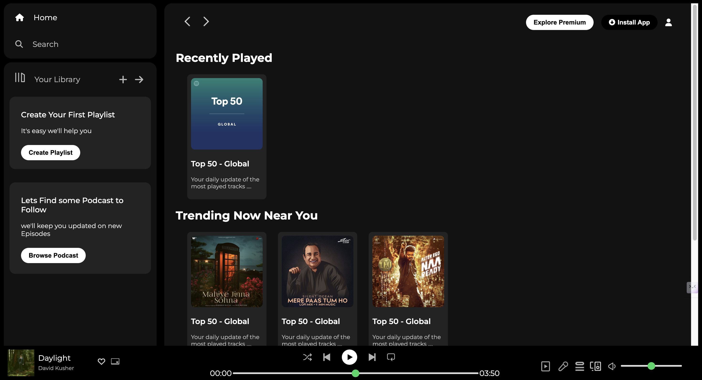
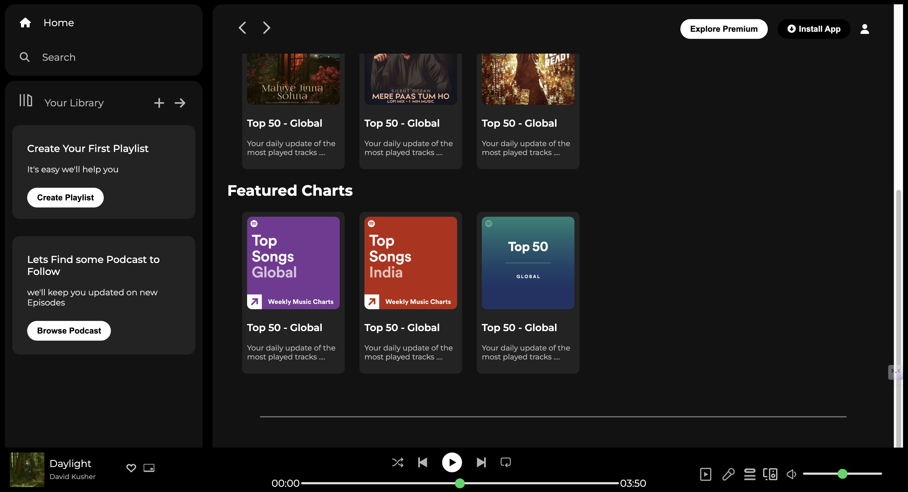

# Spotify Web Player Clone

## Overview

The Spotify Web Player Clone is a project that replicates the appearance of the Spotify web player interface. It provides a static user interface similar to Spotify, allowing users to visualize the layout and design without actual browsing capabilities or dynamic content loading.

## Features

- Replicates the appearance of the Spotify web player interface.
- Provides a static representation of playlists and music recommendations.
- Includes basic music playback controls for demonstration purposes.

## Requirements

- Web browser (Chrome, Firefox, Safari, etc.)

## Usage

1. Open the `index.html` file in a web browser.
2. Explore the static representation of playlists and music recommendations.
3. Use the basic music playback controls to control playback.

## Files

- `index.html`: HTML file containing the structure of the web page.
- `style.css`: CSS file containing the styles for the web page layout and elements.
- `assets/`: Directory containing images and icons used in the project.

## Preview

